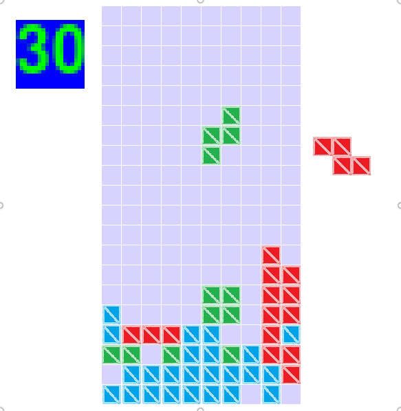

# Tetris

# How to Run
Either `./Tetris.py` or `python2 Tetris.py`

# Dependencies
1. python2
2. pygame

# Controls
* Up to rotate the shape
* Left and right for horizontal movement
* Down to move one step down
* Space to move it all the way down to the base

# License
The MIT License
